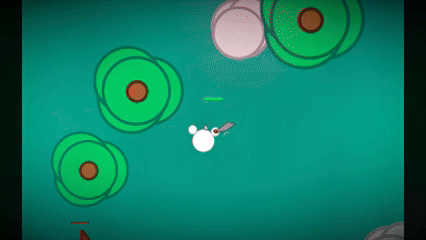

# 🛡️ Survivor 🛡️

**Survivor** is an immersive survival game where you must outlast relentless monsters in a perilous world. Armed with your wits and reflexes, engage in fast-paced combat, explore the environment, and make sure you’re always a step ahead of the creatures lurking around every corner. 



## 🎮 Gameplay Overview

- **Combat**: Use the left mouse button to attack nearby monsters. Stay close enough to land a hit, but be careful—the monsters are always closing in!
- **Movement**: Navigate the game world with ease using the classic W, A, S, D keys for movement.
- **Survival**: Monsters will chase and attack if they get too close. Keep your distance to survive, but when you run out of health, it’s game over!
- **Persistence**: Your progress is saved automatically. Pick up right where you left off when you return to the game.
- **Permadeath**: Once your health reaches 0, the world is lost forever. You’ll need to create a new game and start fresh.

## 🛠️ Getting Started

To dive into the world of *Survivor*, follow these steps:

1. **Clone the Repository**:
   ```bash
   git clone https://github.com/your-repo/survivor.git
   ```

2. **Install Dependencies**:
   Make sure you have Python installed, then run:
   ```bash
   pip install -r requirements.txt
   ```

3. **Start the Game**:
   Launch the game by running:
   ```bash
   python main.py
   ```

4. **Enjoy**:
   Step into a world teeming with monsters and fight for survival!
  
## 🛡️ Controls

- **Move**: W, A, S, D
- **Attack**: Left Mouse Button
- **Quit Game**: ESC (Your saved progress will allow you to continue next time)
  
## 🧰 Technologies Used

- **Python**: Core game logic and mechanics
- **Pygame**: For rendering and handling user input

## 💬 Feedback and Contributions

We’d love to hear your thoughts on *Survivor*! Feel free to submit issues or feature requests via GitHub, or contribute directly by submitting a pull request.

---

Happy surviving! 🌍🧟‍♂️

